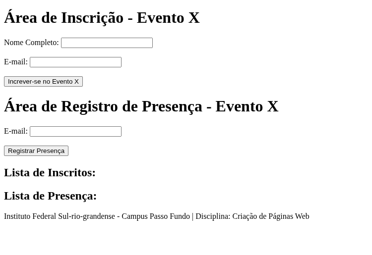

# Relatório de Progresso Semanal | Trabalho Final | Controle de Presenças em Evento

### Nome: Pedro Henrique Carteli Rossetto

## Relatório de Progresso - Semana 1

### Data: 11/06/2025 - Quarta Feira

#### Progresso até então:

    1. Criação da pasta do trabalho segundo o padrão estabelecido
    2. Inserção da pasta dentro de repositório do github
    3. Criação da estrutura de pastas
    4. Linkagem dos arquivos de html,css e js
    5. Instalação da extensão "Markdown All in One"
    6. criacao hmtl

#### HTML:

```
<!DOCTYPE html>
<html lang="pt-BR">
<head>
    <meta charset="UTF-8">
    <meta name="viewport" content="width=device-width, initial-scale=1.0">
    <title>Controle de Presenças Evento X</title>
    <link rel="stylesheet" href="../css/estilo.css">
</head>
<body>
    <div class="campo_inscricao">
        <h1>Área de Inscrição - Evento X</h1>
        <form id="form_inscricao">
            <label for="name">Nome Completo:</label>
            <input type="text" id="name" name="name" required>
            <br>
            <br>
            <label for="email">E-mail:</label>
            <input type="email" id="email" name="email" required>
            <br>
            <br>
            <button type="submit">Increver-se no Evento X</button>
        </form>
    </div>


    <div class="campo_presenca">
        <h1>Área de Registro de Presença - Evento X</h1>
        <form id="form_presenca">
            <label for="email_presenca">E-mail:</label>
            <input type="email" id="email_presenca" name="email_presenca" required>
            <br>
            <br>
            <button type="submit">Registrar Presença</button>
        </form>
    </div>

    <div class="campo_participantes">
        <h2>Lista de Inscritos:</h2>
        <ul id="lista_inscritos">
            <!-- Lista de inscritos será preenchida aqui -->
        </ul>
        <h2>Lista de Presença:</h2>
        <ul id="lista_presentes">
            <!-- Lista de presenças será preenchida aqui -->
        </ul>
    </div>
    <script src="../js/script.js"></script>
      <footer>
    <p>Instituto Federal Sul-rio-grandense - Campus Passo Fundo | Disciplina: Criação de Páginas Web</p>
  </footer>
</body>
</html>
```

#### Página até então:



## Relatório de Progresso - Semana 2

### Data: 16/06/2025 - Segunda Feira

Progredi no desenvolvimento do javascript.
criei funções para o manuseio dos formulários (passo 2) utilizando os dados dos formularios como listas e regex simples (formulas pesquisadas) para manuseio.

percebi que a forma de manipulação por lista estava inadequada para o projeto, finalizei o dia com o intuito de reformular na quarta feira para abordagem por dicionário afim de melhor manipular os dados de nome/email, formato pelo qual tenho também maior experiência, ainda que praticamente nula pela minha inexperiência em javascript.

### Data: 18/06/2025 - Segunda Feira

Reformulei a lógica para utilização de dicionários
basicamente um dicionario com o seguinte formato:

```
"email@exemplo.com": { nome: "Nome Completo", presente: false },
"email2@email.com": { nome: "Nome Completo", presente: true }
```

todo novo inscrito começa como false

se o item presente for verdadeiro, irá ser movido para a lista de presentes e retirada da ausentes
validação de existência e de status

#### JavaScript:

```
// Dicionário principal para controle do código
let participantes = {};

const form_inscricao = document.getElementById("form_inscricao");
const form_presenca = document.getElementById("form_presenca");
const lista_inscritos = document.getElementById("lista_inscritos");
const lista_presentes = document.getElementById("lista_presentes");

form_inscricao.addEventListener("submit", handleInscricaoSubmit);
form_presenca.addEventListener("submit", handlePresencaSubmit);

function handleInscricaoSubmit(event) {
  event.preventDefault();

  const form_data = new FormData(event.target);
  const nome = form_data.get("name");
  const email = form_data.get("email").toLowerCase().trim();

  if (participantes[email]) {
    alert("Email já cadastrado!");
    return;
  }

  const nome_formatado = nome
    .toLowerCase()
    .split(/\s+/)
    .map((word) => word.charAt(0).toUpperCase() + word.slice(1))
    .join(" ");

  participantes[email] = {
    nome: nome_formatado,
    presente: false,
  };

  const novo_item_inscrito = document.createElement("li");
  novo_item_inscrito.textContent = `Nome: ${nome_formatado}, Email: ${email}`;
  novo_item_inscrito.id = email;

  lista_inscritos.appendChild(novo_item_inscrito);

  event.target.reset();
  alert("Inscrição realizada com sucesso!");
}


function handlePresencaSubmit(event) {
  event.preventDefault();

  const form_data = new FormData(event.target);
  const email = form_data.get("email").toLowerCase().trim();

  const participante = participantes[email];

  if (!participante) {
    alert("Email não encontrado na lista de inscritos.");
    return;
  }

  if (participante.presente) {
    alert("Presença já registrada para esse email!");
    return;
  }

  participante.presente = true;

  // Usamos o email para encontrar o elemento pelo ID.
  const item_para_mover = document.getElementById(email);

  if (item_para_mover) {
    item_para_mover.remove();
  }

  const novo_item_presente = document.createElement("li");
  novo_item_presente.textContent = `Nome: ${participante.nome}, Email: ${email}`;

  lista_presentes.appendChild(novo_item_presente);

  event.target.reset();
  alert("Presença registrada com sucesso!");
}

```
## Relatório de Progresso - Semana 3
Criação do CSS

### Data: 25/06/2025 - Quarta Feira
```
body {
    background-image: url('../fundo_sao_joao.jpg');
    background-size: cover;
    background-repeat: no-repeat;
    background-attachment: fixed;
    border: 3px solid black;
    display: flex;
    flex-direction: column;
    justify-content: space-evenly;
    align-items: center;
    min-height: 90vh;
}
h2 {
    text-align: center;
    color: #333;
}
.col {
    flex-direction: column;
    display: flex;
    justify-content: space-evenly;
    align-items: center;    
    width: 100%;
    max-width: 600px;
    margin: 10px;
}
footer{
    background-color: #ffefe0;
    margin: auto;
    border: 3px solid black;
    padding: 20px;
    text-align: center;
    position: fixed;
    width: 100%;
    bottom: 0;
}

```
